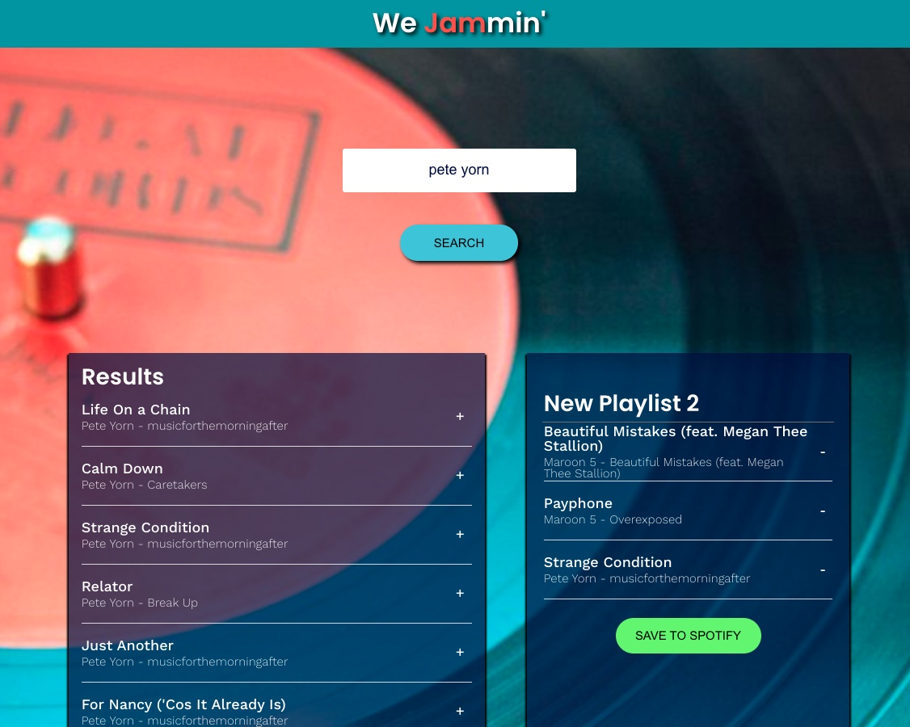

# We Jammin'

In this project, I built a React web application called We Jammin'. 
I used my knowledge of React components, passing state, 
and requests with the Spotify API to build a website 
that allows users to search the Spotify library, 
create a custom playlist, then save it to their Spotify account.
-
-
-
    
     
   
Project Deployment:  <a href='http://we_jammin.surge.sh/'>http://we_jammin.surge.sh/</a>
-
-
-
-
-
  
  
    

